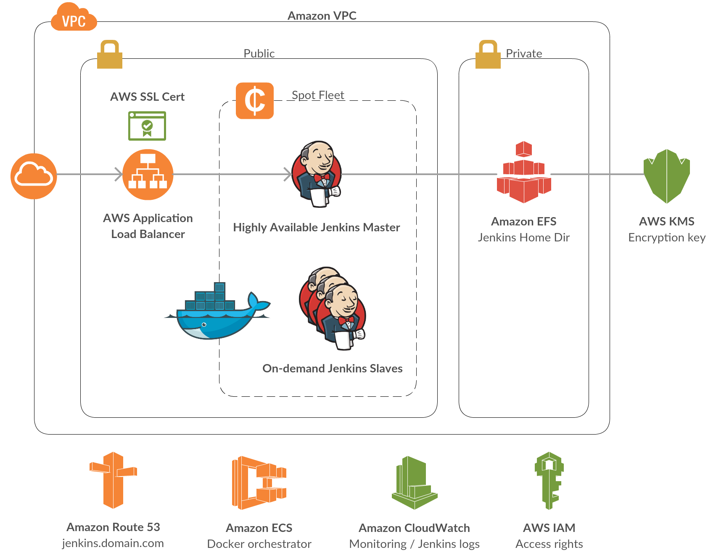

# Enterprise Grade Jenkins
Enterprise Grade Jenkins CI on AWS Cloud

## Specifications

- **Security**: no builds should run on the master. Slaves will be running jobs. Master node will be accessible through HTTPS. Slaves communnicate with the master within the private network.
- **High Availability**: master node will be stateless. One instance of the master will be up at a time. In case of failure a new instance will pop up automatically. Jenkins data storage will be on a network file system.
- **Scaling**: slaves will be created on-demand as Docker containers. Communication with the master is dynamic. Docker host ports are dynamic.
- **Cost**: server resources will be Spot instances. Storage is based on Amazon EFS, pricing on usage.

## Architecture



## Prerequisites

- Install Docker
- Install AWS CLI
- Configure IAM access rights
- Create an ECR repository in your deployment region
- Create an ACM certificate in your deployment region
- Create an EC2 key pair in your deployment region
- Have a Route 53 domain

## Jenkins Master Docker Image

```
cd jenkins-master
docker build -t jenkins-master .
$(aws ecr get-login --no-include-email)
docker tag jenkins-master:latest 123456789123.dkr.ecr.us-east-1.amazonaws.com/jenkins-master:1.0.0
docker push 123456789123.dkr.ecr.us-east-1.amazonaws.com/jenkins-master:1.0.0
```

## Example CloudFormation command

```
aws cloudformation deploy
  --stack-name meudre-jenkins
  --template-file cloudformation.yml
  --capabilities CAPABILITY_NAMED_IAM
  --parameter-overrides
    EnvironmentName=meudre-jenkins
    ClusterAMI=ami-5253c32d
    CertificateArn=arn:aws:acm:us-east-1:123456789123:certificate/7b795cb3-b071-4334-af3c-efa9b85dffd8
    MasterECR=123456789123.dkr.ecr.us-east-1.amazonaws.com/jenkins-master
    MasterECRTag=1.0.0
    Route53HostedZone=meudre.com.
    AdminIpAddress=1.2.3.4/32 
    KeyName=bmeudre-virginia
```

## Jenkins configuration

Wait until CloudFormation finishes creating the stack. Then go to the Amazon CloudWatch service in the AWS Web Console. Choose the left tab **Logs** and filter by **/ecs**. Click the Log Group of your Jenkins Master and then click the button **Search Log Group**. Scroll until you see these lines:
```
*************************************************************
*************************************************************
*************************************************************
Jenkins initial setup is required. An admin user has been created and a password generated.
Please use the following password to proceed to installation:
64b6cc67ee424b39bba0b72a38f7e298
This may also be found at: /var/jenkins_home/secrets/initialAdminPassword
*************************************************************
*************************************************************
*************************************************************
```
Copy the password and paste it at the URL https://jenkins.domain.com. Choose to install plugins or not. Create a first admin user. Click **Save and Continue** and validate the suggested Jenkins URL. You should now have access to your Jenkins Master! If the Home Page is not showing up, process with a restart by hitting the https://jenkins.domain.com/restart URL.

### Configure System

- Number of executors: 0
- Usage: Only build jobs with label expressions matching this node
  
### Configure Global Security

- TCP port for JNLP agents: 50000 (Fixed)
- Agent protocols: Java Web Start Agent Protocol/4 (TLS encryption)
- Prevent Cross Site Request Forgery exploits: Enabled
- Enable Agent → Master Access Control: Enabled

### Manage Plugins

To enable full scaling of the solution, I had to make some changes to the **Amazon EC2 Container Service plugin** to allow private dynamic communication between the master and the slaves. HPI file is available [here](https://github.com/bmeudre/amazon-ecs-plugin/releases/tag/amazon-ecs-1.17) as **amazon-ecs.hpi.zip**. You just have to go to the **Advanced** tab and upload the file manually.

## Configure the Amazon EC2 Container Service plugin

- Go to **Configure System**
- At the bottom of the page, click **Add a new cloud**
- Enter a **Name**, for example *meudre-jenkins*
- Select (or Add) your AWS Credentials
- Select your deployment region
- Select your ECS cluster, created by CloudFormation
- Click the **Advanced** button and enable the **Local ECS Master**
- Click the **Add** button
- Enter a **Label**, for example *ecs-cloud*. You will need to specify it in your jobs.
- Enter a **Template Name**, for example *slave*
- Enter the **Memory** and **CPU** information, for example *1000* and *500*
- Click the **Save** button
